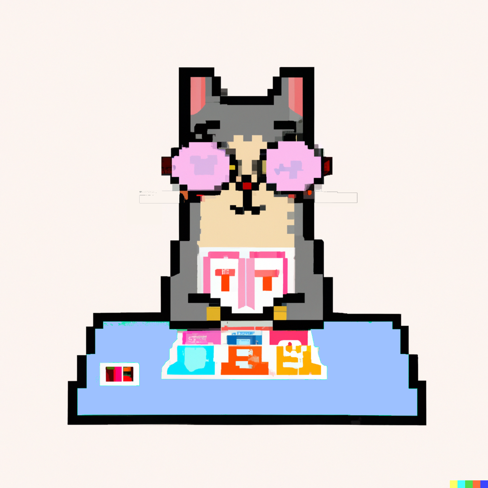

# Kartenmaster: The Ultimate UNO Player



## Overview

Kartenmaster aims to create the perfect UNO player using Reinforcement Learning. Born out of a project at SIT in Tokyo, our team is dedicated to building a robot that can outplay any human at UNO.

## Table of Contents

- [Overview](#overview)
- [Technologies](#technologies)
- [Getting Started](#getting-started)
  - [Prerequisites](#prerequisites)
  - [Installation](#installation)
- [Usage](#usage)
- [Project Structure](#project-structure)
- [Contributing](#contributing)
- [License](#license)
- [Acknowledgements](#acknowledgements)

## Technologies

- **Artificial Intelligence**: Python
- **Environment**: OpenAI Gym
- **Frontend**: SvelteKit

## Getting Started

### Prerequisites

- Python 3.x
- OpenAI Gym
- Node.js and npm (for SvelteKit)

### Installation

1. Clone the repository
   ```bash
   git clone https://github.com/yourusername/kartenmaster.git
   ```
